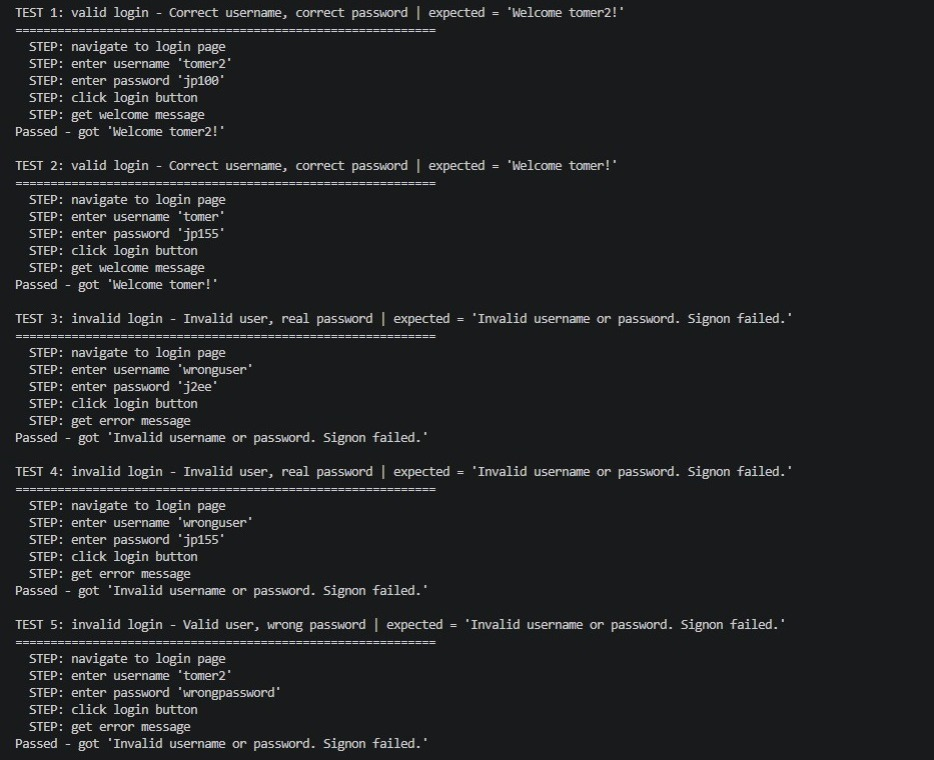
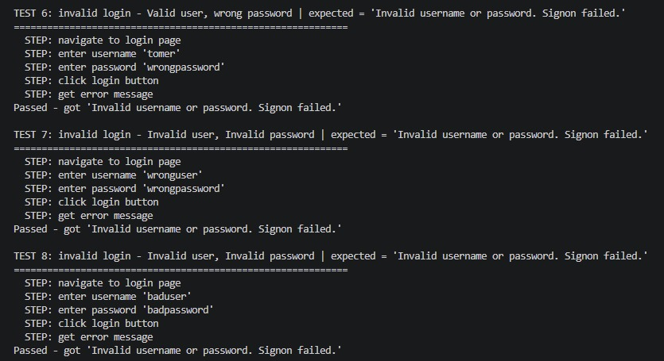

# JPetStore Login Automation

Selenium automation project (Page Object Model) covering the login flow of
the public JPetStore demo site: [https://petstore.octoperf.com/](https://petstore.octoperf.com/actions/Catalog.action)

## Scope

Plan, write, and run an automated Selenium/Python test suite for the
JPetStore login flow, covering:

| # | Test case | Expected result |
|---|---|---|
| 1 | Login — invalid username, valid password | Error message |
| 2 | Login — valid username, invalid password | Error message |
| 3 | Login — invalid username, invalid password | Error message |
| 4 | Login — valid username, valid password | "Welcome" message on the home screen |

Requirements:
- Every scenario runs at least twice, with different test data (2
  manually-registered demo users), and passes
- Condition-based synchronization waits (5s default) wherever needed — no
  hardcoded `sleep`
- Generic, data-driven scripts — not one hardcoded script per case
- Page Object Model — page classes, test scripts, and test data kept in
  separate modules
- Step-by-step logging: which step ran, the expected result, pass/fail
- Clear code — meaningful function/class names, comments in the code

## Structure

- `pages/` — Page Object classes (`BasePage`, `LoginPage`, `HomePage`)
- `scripts/login_scripts.py` — login test scenarios (valid/invalid login)
- `data/login_case.py` — test data container
- `main.py` — test runner
- `register_users.py` — setup script to register the demo users used by the
  tests. The demo site periodically wipes its registered users, so this
  script may need to be re-run occasionally — check that the login tests in
  `main.py` still pass first; if the valid-login cases start failing, re-run
  `register_users.py` to recreate the accounts

## Setup

This project is self-contained — its own virtual environment and
dependencies, independent of the rest of the portfolio. Requires Python
3.10+ (developed and tested with 3.14).

1. From inside this folder, create and activate a virtual environment:
   ```powershell
   python -m venv venv
   .\venv\Scripts\Activate.ps1
   ```
   (macOS/Linux: `source venv/bin/activate`)
2. Install dependencies:
   ```
   pip install -r requirements.txt
   ```
3. Copy `.env.example` to `.env` and fill in real values — either register
   your own demo users at petstore.octoperf.com (see `register_users.py`) or
   use existing ones:
   ```
   TOMER_USERNAME=...
   TOMER_PASSWORD=...
   TOMER2_USERNAME=...
   TOMER2_PASSWORD=...
   ```
4. Run:
   ```
   python main.py
   ```

## Evidence

Full passing run (all 8 test cases):




## Future improvements

- Convert the runner from a hand-rolled script (prints + try/except) to
  pytest, for real test discovery, fixtures, and standard reporting.
